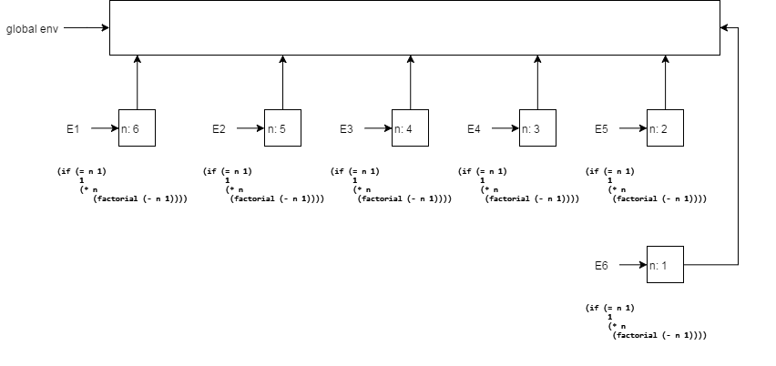
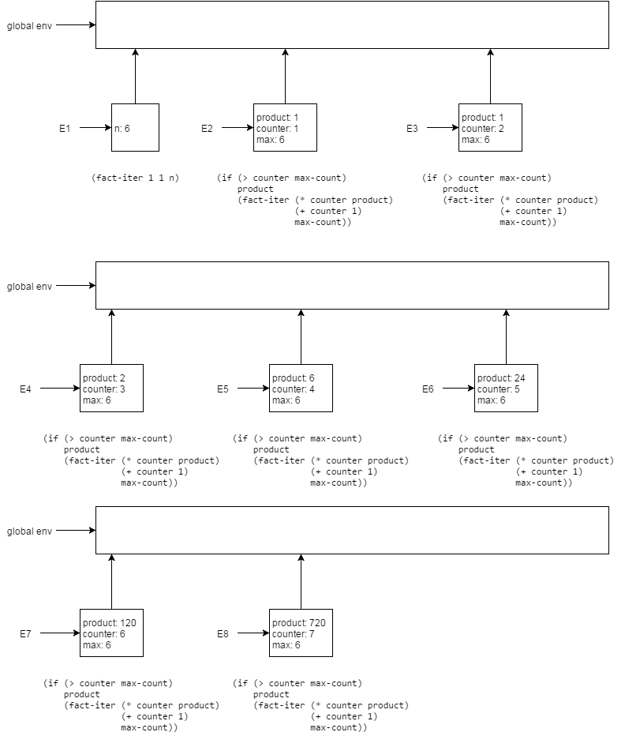
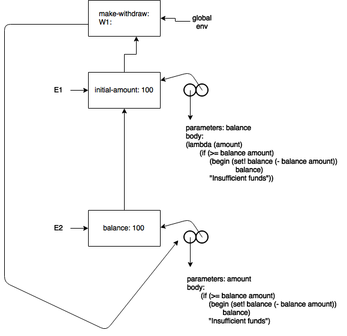
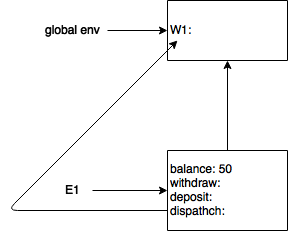
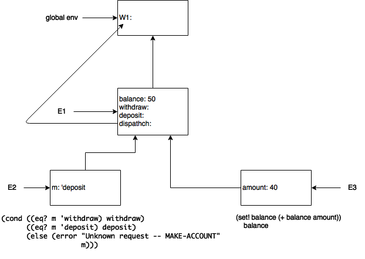

###Ex 3.9

Here is the diagram for the recursive version of `factorial`:



And here is the diagram for the iterative version:



###Ex 3.10
If we "desugar" the `let` expression, we get the following:

```scheme
(define (make-withdraw initial-amount)
  ((lambda (balance)
     (lambda (amount)
       (if (>= balance amount)
	   (begin (set! balance (- balance amount))
		  balance)
	   "Insufficient funds"))) initial-amount))
```

A `let` reduces to a `lambda` which we immediately apply.

Here is the resulting diagram from the expression `(define W1 (make-withdraw 100))`:




when we apply `make-withdraw` to `100`, the first thing we do is create a new environment, `E1`.  `E1` contains a single binding, which binds `initial-value` to `100`.  Within `E1`, we then evaluate the body of `make-withdraw`.  The body is a procedure application, but the procedure being applied must first be created by `lambda`, so we create a new procedure object, which takes a single parameter, `balance`, with the given body (which is another call to `lambda`) and whose environment pointer points to `E1`.  Then we immediately apply the created procedure to `initial-value` in `E1`, which results in the creation of `E2`, which points to `E1`, and contains a binding from `balance` to `100`.  The body of the procedure created from the first `lambda` is itself a call to `lambda`, so we create a second procedure object, which takes as a parameter `amount`, and whose enviroment pointer points to `E2`.  This procedure object is the result of the original application of `make-withdraw`, so back in the global environment, `W1` is now bound to this procedure object.

After this, the application of `(W1 50)` is very similar to the example given in the book, so I won't bother making a diagram for it.  `(define W2 (make-withdraw 100))`, will create seperate evironments `E3` and `E4` analogous to `E1` and `E2` respectively.

###Ex 3.11

Here is the diagram for `(define acc (make-account 50))`:



I dont show the separate procedure objects, so you'll have to use your imagination :).

Here is the diagram for `((acc 'deposit) 40)`:



Here, environment `E2` is set up for the application of `acc` to `'deposit`, which evaluates to the `deposit` procedure.  Then `E3` is set up in order to apply `deposit` to `40`.

The local state for `acc` is stored in `E2`, where `balance` is bound.  Likewise, for `acc2`, its state would be in the environment that was setup in order to apply `make-account` to `100`.  Other than the different instances of `balance`, `acc` and `acc2` share th same `withdraw`, `deposit` and `dispatch` methods, both environments (`acc`'s and `acc2`'s) could point to the same procedure objects.
