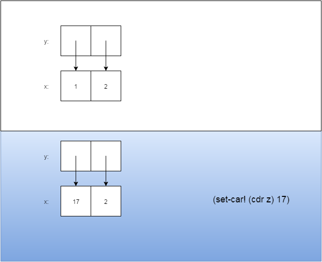
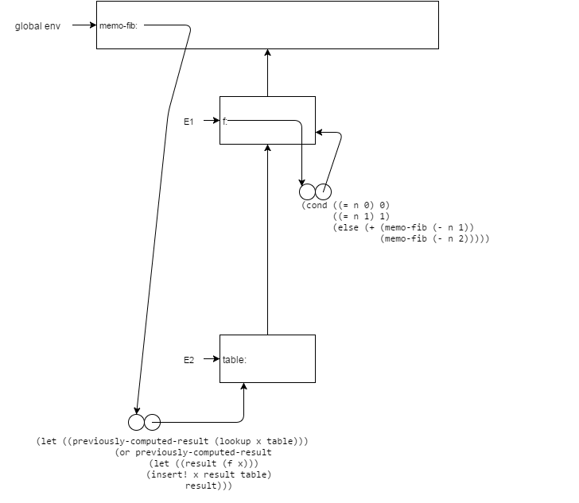
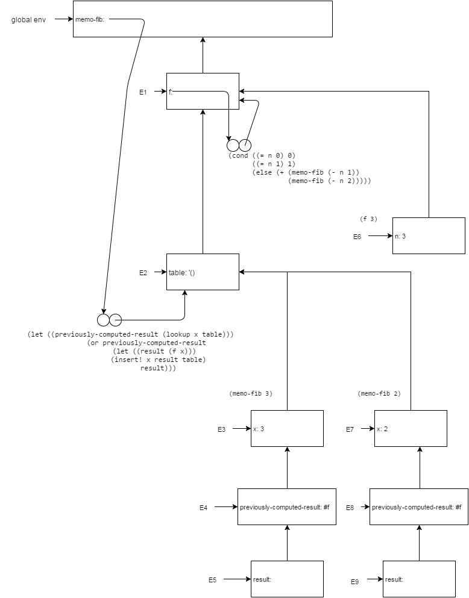
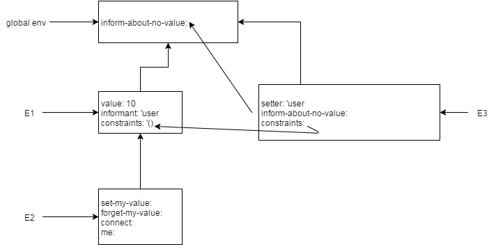

###Ex 3.12

For the first `<response>`, note that `z` was created using `append` (no '!').  This means that it does not perform assignment, and the list that it returns is a completely new one.  Therefore, up to this point, `x` remains unchanged, so `(cdr x)` will print `(b)` here.

For the next `<response>`, we use `append!` which does perform assignment (i.e. it modifies its arguments).  `append!` will modify the `cdr` of the last pair of `x` to point to `y` instead of a null. Now, `w` and `x` are actually two names pointing to the same thing: the list `(a b c d)`.  So at this point `(cdr x)` will print `(b c d)`.

Here is diagram to illustrate the difference.  Notice how the `append!` does not create any new structures, whereas `append` does:


###Ex 3.13

Trying to compute `(last-pair z)` will result in infinite iteration (infinite loop).  This is because `last-pair` keeps taking the `cdr` of a list until it encounters a `null`, but since `z` is a cycle, there is no pair in the list whose `cdr` is a `null`.

Here is the corresponding box-and-pointer diagram:


###Ex 3.14
Here is the code for `mystery`:

```scheme
(define (mystery l)
  (define (loop x y)
    (if (null? x)
        y
        (let ((temp (cdr x)))
          (set-cdr! x y)
          (loop temp x))))
  (loop l '()))
```

So that's it's not so confusing, I've renamed the `x` bound by `mystery` to `l`.  This doesn't affect the program at all because in the original version, `loop`'s `x` shadows it.  After careful studying of the code, we can see that it reverses the list `l`.

Here is how the reversal is done:  for `loop`, the parameter `x` is the remaining list, and `y` is the partially constructed reverse of the original list.  Within the `let` expression, the variable `temp` is created and bound to the `cdr` of the remaining list `x`.  Then, by setting the `cdr` of `x` to point to `y`, we've preserved the head of the list, but the tail is now all of the elements that originally came before it, but in reverse.  `loop` then recurses on itself, this time with `temp` being the "remaining list", and `x` (which has been modified), as the partially constructed reversal of the list.

For the following expressions:

```scheme
(define v (list 'a 'b 'c 'd))
(define w (mystery v))
```

Determining what evaluating `v` would print is a little tricky.  For `v`, we get `(a)`.  This is because on the very first iteration of `loop` within `mystery`, `x` points to the same list `v` does, and it sets its `cdr` to `y`.  At this point, `y` is `'()`.  As for `w`, it's just the reverse of the original list.

Here is the corresponding box-and-pointer diagram:


###Ex 3.15

Here is the box-and-pointer diagram for `(set-to-wow! z1)`:


and here is the diagram for `(set-to-wow! z2)`:


###Ex 3.16
The reason that `count-pairs` is not correct is because it doesn't account for things like cycles, and for multiple pointers pointing to the same pair.

`count-pairs` would tell us that something like `(cons 1 (cons 2 (cons 3 '())))` consists of 3 pairs.  Here, none of the `cons` cells point back on to each other, so there is nothing to trip up `count-pairs`.

However, `count-pairs` would tell us that something for something like

```scheme
(define z (cons 1 2))
(define z2 (cons z z))
(define z3 (cons z2 '()))
```

There are 4 pairs.  The reason is that the `car` and `cdr` of `z2` both point to `z`.  This causes `count-pairs` to to count `z` twice, once when it follows the `car` of `z2`, and another when it follows the `cdr`, counting the pair `z2`, it thinks `z2` consists of 3 pairs, and `z3` provides the fourth.

by modifying the code above slightly so that `z3` has `z2` for its `car` *and* `cdr`, we get `count-pairs` to count `z2` twice, giving us 6, then the 7th from `z3`.

To cause `count-pairs` to never return at all, we can simply give it a list with a cycle.  For obvious reason, this will never return because it can always follow the `cdr` of the list.


###Ex 3.17

Here's a solution that works:

```scheme
(define (count-pairs x)
  (define seen '())
  (define (recur x)
    (cond ((not (pair? x)) 0)
          ((memq x seen) 0)
          (else
           (begin (if (null? seen)
                      (set! seen (cons x '()))
                      (append! seen (list x)))
                  (+ 1
                     (recur (car x))
                     (recur (cdr x)))))))
  (recur x))
```

Note how the structure is very similar to Ben's.  For my solution however, we define an inner `recur` procedure.  The important addition here is the `seen` list, which is defined within `count-pairs`.  Everytime `recur` encounters a pair it hasn't seen it, it adds it to the list, then recurses on its `car` and `cdr`.  If `recur` is given something that isn't a pair, or one that it's already seen, it returns 0.  This is a basically a graph search.

###Ex 3.18

The solution is identical to the solution for 3.17.  We keep a list of nodes in the list that we've already seen, and if we come upon a node that is in that list, then we report a cycle.

```scheme
(define (contains-cycle? l)
  (define (iter seen x)
    (cond ((and (not (null? seen))
                (memq x seen))
           #t)
          ((null? x) #f)
          (else (iter (cons x seen) (cdr x)))))
  (iter '() l))
```

###Ex 3.19

One solution to this problem is called the ["Tortoise and the Hare Algorithm"](https://en.wikipedia.org/wiki/Cycle_detection#Tortoise_and_hare).  The idea is simple, we have two pointers to the data, `t` and `h`.  `t` always advances one place each iteration, and `h` advances two positions, so that if `t` is at position $$i$$, then `h` is at position $$2i$$.  If there's a cycle in the list, then at some point, `t` and `h` will be on top of each other.

With this is mind, here is the code:

```scheme
(define (contains-cycle? l)
  (define (move x n)
    (cond ((= n 0) x)
          ((null? x) #f)
          (else (move (cdr x) (- n 1)))))
  (define (iter t h)
    (cond ((or (not t) (not h)) #f)
          ((eq? t h) #t)
          (else (iter (move t 1) (move h 2)))))
  (iter l (move l 2)))
```

###Ex 3.20

I think the most intesting part are the first two lines, so I'll just focus on that for the diagram:



For `(define x (cons 1 2))`, we create an entry in the current environment--global environment--`x`.  `x` points is the result of a procedure application `(cons 1 2)`, so we set up a new environment `E1`, in order to evaluate the application.  We have entries for `x` and `y`, which bind the arguments to `cons`, as well as entries `set-x!`, `set-y!`, and `dispatch`, which are defined within `cons`.  `cons` returns `dispatch` as its result, so back in the global environment, `x` is pointing to the `dispatch` procedure object.

A similar thing happens for `(define z (cons x x))`.  However, this time, within `E2`, the entries `x` and `y` are both pointers to the same thing, the `dispatch` procedure from `E1`.

###Ex 3.21

What's tripping Ben up are the last three expressions and their results:

```scheme
(insert-queue! q1 'b)
=> ((a b) b)
(delete-queue! q1)
=> ((b) b)
(delete-queue! q1)
=> (() b)
```

The interpreter prints two "b"'s so he assumes that there are two of them in the queue.  What Eva essentially tells him is that the interpreter knows nothing about how interpret our custom data structure.  It only knows how to print the contents of a `cons` cell.  Our "queue" is a single pair, whos `car` points to the head of a list, and `cdr` ponts to the last pair of the same list.  That is why the first expression prints out `((a b) b)`.  The contents of the list are `(a b)`, so when we it display `q1`, the result of the interpreter printing the `car` is the entire list, and when it prints the `cdr`, it's just `b`. When we've deleted both everything from the list, we get the odd result `(() b)` because the rear pointer is never modified, it's still pointing to the last pair in the list, whereas the front pointer now points to `'()`, telling us that the queue is empty.  Knowing all this, the proper way to print the queue would be to actually just follow the front pointer:

```scheme
(define (print-queue q)
  (define (iter x)
    (if (not (null? x))
        (begin
          (display (car x))
          (if (not (null? (cdr x)))
              (display " "))
          (iter (cdr x)))))
  (display "(")
  (iter (front-ptr q))
  (display ")")
  (newline))
```

###Ex 3.22
```scheme
#lang planet neil/sicp

(define (make-queue)
  (let ((front-ptr '())
        (rear-ptr '()))
    (define (empty-queue?)
      (null? front-ptr))
    (define (front)
      (car front-ptr))
    (define (insert-queue! x)
      (let ((new-pair (cons x '())))
        (cond ((empty-queue?)
               (set! front-ptr new-pair)
               (set! rear-ptr new-pair))
              (else
               (set-cdr! rear-ptr new-pair)
               (set! rear-ptr new-pair)))))
    (define (delete-queue!)
      (if (not (empty-queue?))
          (cond ((eq? front-ptr rear-ptr)
                 (set! front-ptr '())
                 (set! rear-ptr '()))
                (else
                 (set! front-ptr (cdr front-ptr))))))
    (define (print-queue)
      (define (iter x)
        (if (not (null? x))
            (begin
              (display (car x))
              (if (not (null? (cdr x)))
                  (display " "))
              (iter (cdr x)))))
      (display "(")
      (iter front-ptr)
      (display ")")
      (newline))
    (define (dispatch m)
      (cond ((eq? m 'empty-queue?) empty-queue?)
            ((eq? m 'front) front)
            ((eq? m 'print-queue) print-queue)
            ((eq? m 'insert-queue!) insert-queue!)
            ((eq? m 'delete-queue!) delete-queue!)
            (else (error "Unknown message -- QUEUE" m))))
    dispatch))
```

Overrall, it's very much like the book's solution.  Because `front-ptr` and `rear-ptr` are no longer halves of a pair, we don't need to use things like `set-car!` and `set-cdr!`.


###Ex 3.23
For efficient deletions from the rear of the queue, we need a way to access the second-to-last element in $$O(1)$$ time; to achieve this, we need is a *doubly-linked list*.

Each item in the dequeue will be in a *node* made of up two pairs, set up to so that its `car` is the value for stored in that node, and its `cdr` is another pair, where the this pair's `car` points to the node that is before it, and the pairs `cdr` is after it.

```scheme
(define (make-node x)
  (cons x (cons '() '())))
(define (right-ptr node)
  (cddr node))
(define (left-ptr node)
  (cadr node))
(define (set-right-ptr! node p)
  (set-cdr! (cdr node) p))
(define (set-left-ptr! node p)
  (set-car! (cdr node) p))
```

Adding a new node to the list is a little trickier because each node now has two pointers, but it's not much more complicated.  Insertions at the rear of the deque means that the right pointer of the current last node of the deque needs to point to the new node, and the new node's left pointer now points to the current rear node.  Finally, the `rear-ptr` of the deque is made to point to this new node.

```scheme
(define (rear-insert-deque! x)
  (let ((new-node (make-node x)))
    (cond ((empty-deque?)
           (set! front-ptr new-node)
           (set! rear-ptr new-node))
          (else
           (set-right-ptr! rear-ptr new-node)
           (set-left-ptr! new-node rear-ptr)
           (set! rear-ptr new-node)))))
```

Insertions at the front are basically the same thing, except for which pointers are set to what:

```scheme
(define (front-insert-deque! x)
  (let ((new-node (make-node x)))
    (cond ((empty-deque?)
           (set! front-ptr new-node)
           (set! rear-ptr new-node))
          (else
           (set-right-ptr! new-node front-ptr)
           (set-left-ptr! front-ptr new-node)
           (set! front-ptr new-node)))))
```

Here is the complete listing:

```scheme
(define (make-deque)
  (let ((front-ptr '())
        (rear-ptr '()))
    (define (make-node x)
      (cons x (cons '() '())))
    (define (right-ptr node)
      (cddr node))
    (define (left-ptr node)
      (cadr node))
    (define (set-right-ptr! node p)
      (set-cdr! (cdr node) p))
    (define (set-left-ptr! node p)
      (set-car! (cdr node) p))
    (define (empty-deque?)
      (and (eq? front-ptr '())
           (eq? rear-ptr '())))
    (define (front-insert-deque! x)
      (let ((new-node (make-node x)))
        (cond ((empty-deque?)
               (set! front-ptr new-node)
               (set! rear-ptr new-node))
              (else
               (set-right-ptr! new-node front-ptr)
               (set-left-ptr! front-ptr new-node)
               (set! front-ptr new-node)))))
    (define (rear-insert-deque! x)
      (let ((new-node (make-node x)))
        (cond ((empty-deque?)
               (set! front-ptr new-node)
               (set! rear-ptr new-node))
              (else
               (set-right-ptr! rear-ptr new-node)
               (set-left-ptr! new-node rear-ptr)
               (set! rear-ptr new-node)))))
    (define (rear-delete-deque!)
      (if (eq? front-ptr rear-ptr)
          (begin
            (set! front-ptr '())
            (set! rear-ptr '()))
          (let ((prev (left-ptr rear-ptr)))
            (set-left-ptr! rear-ptr '())
            (set-right-ptr! prev '())
            (set! rear-ptr prev))))
    (define (front-delete-deque!)
      (if (eq? front-ptr rear-ptr)
          (begin
            (set! front-ptr '())
            (set! rear-ptr '()))
          (let ((next (right-ptr front-ptr)))
            (set-right-ptr! front-ptr '())
            (set-left-ptr! next '())
            (set! front-ptr next))))
    (define (front-deque)
      (car front-ptr))
    (define (rear-deque)
      (car rear-ptr))
    (define (print-deque)
      (define (iter x)
        (if (not (null? x))
            (begin
              (display (car x))
              (display " ")
              (iter (right-ptr x)))))
      (iter front-ptr)
      (newline))
    (define (dispatch m)
      (cond ((eq? m 'empty-deque?) empty-deque?)
            ((eq? m 'front-insert-deque!) front-insert-deque!)
            ((eq? m 'rear-insert-deque!) rear-insert-deque!)
            ((eq? m 'rear-delete-deque!) rear-delete-deque!)
            ((eq? m 'front-delete-deque!) front-delete-deque!)
            ((eq? m 'front-deque) front-deque)
            ((eq? m 'rear-deque) rear-deque)
            ((eq? m 'print-deque) print-deque)
            (else (error "Unknown message -- DEQUE" m))))
    dispatch))
```

###Ex 3.24

Here is the full listing:

```scheme
(define (make-table same-key?)
  (let ((local-table (list '*table*)))
    (define (assoc key records)
      (cond ((null? records) false)
            ((same-key? key (caar records)) (car records))
            (else (assoc key (cdr records)))))
    (define (lookup keys)
      (define (iter k rec)
        (if (null? k)
            (cdr rec)
            (let ((rec2 (assoc (car k) (cdr rec))))
              (if rec2
                  (iter (cdr k) rec2)
                  false))))
      (iter keys local-table))
    (define (insert! keys value)
      (define (iter keys st)
        (if (not (null? keys))
            (let ((rec (assoc (car keys) (cdr st))))
              (if rec
                  (if (null? (cdr keys))
                      (set-cdr! rec value)
                      (iter (cdr keys) rec))
                  (let ((new-rec (list (car keys))))
                    (set-cdr! st
                              (cons new-rec
                                    (cdr st)))
                    (if (null? (cdr keys))
                        (set-cdr! new-rec value)
                        (iter (cdr keys) new-rec)))))))
      (iter keys local-table)
      'ok)
    (define (dispatch m)
      (cond ((eq? m 'lookup-proc) lookup)
            ((eq? m 'insert-proc!) insert!)
            (else (error "Unknown operation -- TABLE" m))))
    dispatch))
```


###Ex 3.25
An important thing to realize is that "subtables" and "records" are really the same thing; the only difference between them is that the "value" portion of a subtable is more tables, whereas a record might have some other arbitrary type of data.

To support arbitrary amount of keys for lookup is pretty easy.  All we do is treat the first key in the list as the key for a subtable, and then recurse on the subtable with the remaining keys.

```scheme
(define (lookup keys)
  (define (iter k rec)
    (if (null? k)
        (cdr rec)
        (let ((rec2 (assoc (car k) (cdr rec))))
          (if rec2
              (iter (cdr k) rec2)
              false))))
  (iter keys local-table))
```

Once we reach the end of the list, we return the `cdr` of the current subtable as the value.

For `insert!`, we maintain the invariant that `keys` in `iter` represents the keys into the current subtable `st` to insert the given `value`.  We iterate over all the keys in the list.  In a given iteration, we lookup the record in the `st` associated with the head of the `keys` list.  There are two cases here of course, that it already exists, or it doesnt.  If it already exists, we have to check if the key that was just looked up is the last one.  If it is, then the record we got will have `value` associated with it.  If there are more keys remaining, then we iterate over the list, using the record as the current subtable.  The case where no record was found for the current key is very similar, but we first create the new empty record and add it to the current subtable.

```scheme
(define (insert! keys value)
  (define (iter keys st)
    (if (not (null? keys))
        (let ((rec (assoc (car keys) (cdr st))))
          (if rec
              (if (null? (cdr keys))
                  (set-cdr! rec value)
                  (iter (cdr keys) rec))
              (let ((new-rec (list (car keys))))
                (set-cdr! st
                          (cons new-rec
                                (cdr st)))
                (if (null? (cdr keys))
                    (set-cdr! new-rec value)
                    (iter (cdr keys) new-rec)))))))
  (iter keys local-table)
  'ok)
```


###Ex 3.26
A table is essentially a set of keys, and the associated value of could possibly be another table (itself a set).  Therefore, to achieve more efficient insertion and lookups, we can switch to using the set representation developed in the previous chapter to achieve logarithmic time lookups and insertions.

###Ex 3.27

Here is roughly what state of things is after we `define` `memo-fib`:



Let's go through it quickly: `E1` is set up to evaluate `(define memo-fib...)`, within which a lambda that computes the Fibonnacci series is created, that recursively calls itself.  Then because there's a `let` inside of the body of `memoize`, we set up another environment, `E2`, which has an entry for `table`, and then we create another procedure.  This procedure is what `memo-fib` points to.

Now, let's see what happens when we evaluate `(memo-fib 3)`.  The diagram is not complete because it gets a bit tedious, but it illustrates pretty clearly what is going on:



The first thing that happens is `E3` is set up with an entry for `x`, the formal parameter of `memo-fib`.  Then `E4` gets set up to find the previously computed value for $$x=3$$.  We don't find one, so yet another environment, `E5` is set up to compute the result (by evaluating `(f 3)`).  This evaluation happens within `E6`.  The evaluation of `(f 3)` results in two recursive calls to `memo-fib`, so we set up `E7`.  The story is the same for `E8` and `E9` as `E4` and `E5` respectively, but this time $$x=2$$.  Then we keep going in a similar fashion, computing $$x=1$$, and $$x=0$$.  Of course at the end of the each computation of `f`, the result is added to `table`, but this isn't shown.

`memo-fib` computes the $$n$$th Fibonacci number in linear time because it only depends on the the value of $$n - 1$$ and $$n - 2$$.  However, because we're using memoization, these values are already computed and stored in the table.  Also, because of the the way `insert!` works, the last two computed values are always the first two entries in the table, so lookup happens in constant time.

No, this would not work if we had done `(memoize fib)`.  Taking a look at the definition of `memoize`, if it doesn't already have a value for the `x`, it will call `(fib x)` to find the value before caching it.  That means that for this to work, the procedure `fib` must also be memoized.
###Ex 3.28

```scheme
(define (or-gate o1 o2 output)
  (define (or-action-procedure)
    (let ((new-value
           (logical-or (get-signal o1) (get-signal o2))))
      (after-delay or-gate-delay
                   (lambda ()
                     (set-signal! output new-value)))))
  (add-action! o1 or-action-procedure)
  (add-action! o2 or-action-procedure)
  'ok)

(define (logical-or s1 s2)
  (if (and (or (= s1 0) (= s1 1))
           (or (= s2 0) (= s2 1)))
      (if (or (= s1 1) (= s2 1))
          1
          0)
      (error "Invalid signals" (list s1 s2))))
```

It's very similar to `and-gate` indeed, and the only change is that we use `logical-or` to determine the new value of the output signal.

###Ex 3.29

We can define an `or-gate` in terms of `and-gates` and `inverters` because $$A \land B \equiv \neg (\neg A \land \neg B)$$.  This also clues us in on how many function boxes of each type we need and how to hook them up: We need to negate the two input signals using two inverters, then use the inverted signals as inputs to an `and-gate`, then finally invert the output of of the `and-gate`.

In terms of delay, it takes one `inverter-delay` to negate the two input signals, then one `and-delay` to then AND them together, then finally one more `inverter-delay` to invert the output of the `and-gate`.

Here is the code listing:

```scheme
(define (or-gate-compound o1 o2 output)
  (let ((not-o1 (make-wire)) (not-o2 (make-wire)) (and-out (make-wire)))
    (inverter o1 not-o1)
    (inverter o2 not-o2)
    (and-gate not-o1 not-o2 and-out)
    (inverter and-out output)
    'ok))
```


###Ex 3.30
The code to do this is surprisingly simple.  The basis of course is when there are no more signal wires left so we just return `'ok`.  If there are more input signals, then we create a new wire to carry the carry signal from the full adder, then wire up the next two input signals and the carry signal from the previous adder into a new full adder, and giving it the next wire from `sk` as the sum of the two signals, and `new-carry` as the carry out from the current full-adder.  Then we recurse on the tail of all the lists, passing `new-carry` along as the input carry for the next full-adder.

```scheme
(define (ripple-carry-adder ak bk sk c)
  (if (null? ak)
      'ok
      (let ((new-carry (make-wire)))
        (full-adder (car ak)
                    (car bk)
                    c
                    (car sk)
                    new-carry)
        (ripple-carry-adder (cdr ak)
                            (cdr bk)
                            (cdr sk)
                            new-carry))))
```

A full-adder consists of two half-adders and an or-gate.  Referring to figure 3.26, the signals from wires $$B$$ and $$C_{in}$$ go through the first half-adder, incurring one half-adder's worth of delay, then the sum of these two signals and $$A$$ go through the second half-adder, incurring another delay, then finally the carry signals from the two half-adders go through or-gate.  So for a full-adder, we have two half-adder delays plus an or-gate delay.

Now referring to figure 3.25, we see that the signals $$A$$ and $$B$$ going into it go through an or-gate and and-gate in parallel, then the output of the and-gate goes through an inverter, the signals on $$D$$ and $$E$$ go through a second or-gate.  In the half-adder, the first and-gate and the inverter are in series, so there's a delay of an and-gate and inverter there.  Then, happening in parallel is the or-gate.  Then finally, the two signals, one from the inverter and the othet from the or-gate go through the second and-gate.  Assumming that the delay of and and-gates and an inverter are longer than a single or-gate, then the total delay of a half-adder is two and-gate delays plus an inverter delay.

The ripple-adder essentially consists of $$k$$ full-adders in series, so the total delay is $$k \cdot D_{FA} = k \cdot (2 \cdot D_{HA} + D_{OR}) = k \cdot (2 \cdot (2 \cdot D_{AND} + D_{INVERTER}) + D_{OR}))$$, where $$D$$ is the delay of a component.

###Ex 3.31
We call the action procedure immediately once it's added to the wire because it ensures that all components in the simulation are in a consistent state.  By calling the action procedure right away, we ensure that any effects the current state of the wire is at the time of addition is reflected within the whole simulation immediately.  If we did not do this, the simulation would not be consistent until the wire's signal changes.  Worse, if the wire's signal never changes, the simulation would be completely inaccurate because the action procedures are never called.

Let's see what happens if we change the `accept-action-procedure!` as the book suggests:

```scheme
define (accept-action-procedure! proc)
  (set! action-procedures (cons proc action-procedures)))
```

Now applying the same procedures as the _sample simulation_:

```scheme
(define input-1 (make-wire))
(define input-2 (make-wire))
(define sum (make-wire))
(define carry (make-wire))
(probe 'sum sum)
; no output...
(probe 'carry carry)
; no output...
```

The difference here is that when we attach either probe, we don't get any output; since the output is a result of the wire calling the action procedure, we will only see it if and when the signal on the wire changes.

On the next set of applications:
```scheme
(half-adder input-1 input-2 sum carry)
ok
(set-signal! input-1 1)
done
(propagate)
done
```

When we attach the half-adder to the input and output wires, again its action procedure is not called.  However, we immediately set the signal of `input-1` to 1, and since it was previously 0, it in turn calls all of the action procedures it has.  No probes are attached to this wire though, so we don't see any output.  Also, since this is a signal flip, the wire will call all of the action procedures it has.

Note also that we don't see anything after calling `propagate`.  Why?  because although the signal on `input-1` is propagated, it doesn't change the state of the `sum` or `carry` wires!  In particular, the inputs nito the second AND gate in the half adder are logically 1 and 0 at this point; because the components aren't being initialized at the moment they're being attached to other things, the output of the inverter is `0`, even though its input is also `0`.  There fore there is no change in the output of the second AND gate and thus no change seen by probe.

Then finally we have:

```scheme
(set-signal! input-2 1)
done
(propagate)
carry 11  New-value = 1
done
```

Again, this is a signal flip on `input-2`, which means it will call its action procedures allowing the signal to `propagate`. Notice again, that the probe on the `sum` wire is not triggered, since once we set the signal in `input-2` to 1, then `sum` is of course 0, but this is not a change in signal to its previous state, so again, the action procedures are not called.


###Ex 3.32

First, let's remember how procedures end up in the agenda in the first place:
the signal on a wire flips, and it calls all the registered action procedures
it has.  These action procedures, like in the case of the *AND* gate, examine
the state of wires it cares about at that instant and reacts accordingly, then
it registers a procedure in the agenda to be run at some point in the future.
The procedures that get added to the agenda only "know" about things that
occurred right up to the point they were created and added.  By this reasoning,
procedures that are added to the agenda after this one have a more up-to-date
view of the state of the simulation than any earlier one.  If procedures are
called in order, then everything is fine because the very last action-procedure
called and also the last to add an item to the agenda, has a complete view of
the world.  In contrast, the first action-procedures that ran did not, and
likely to hold outdated state.

Let's trace through an *AND* gate's inputs inverting as the book instructs us
to do to get a better picture:

```scheme
(define (and-gate a1 a2 output)
  (define (and-action-procedure)
    (let ((new-value
           (logical-and (get-signal a1) (get-signal a2))))
      (after-delay and-gate-delay
                   (lambda ()
                     (set-signal! output new-value)))))
  (add-action! a1 and-action-procedure)
  (add-action! a2 and-action-procedure)
  'ok)
```

First, if both inputs are flipped in the time segment, that means that the
*AND* gate will in turn add two procedures in the same time segment (+
`and-delay` in the future).  If `a1` is flipped first, so that it goes from 0
to 1, then in `and-action-procedure`, `(get-signal a1)` and `(get-signal a2)`
will both return 1, since at this point, only `a1` has changed; `logical-and`
will then evaluate to 1.  At this point, the curent time segment is still in
progress so we're likely to be dealing with information will probably not be
true for long.  Then the `a2` goes from 1 to 0, and so `and-action-procedure`
is called again, so we compute the `logical-and` of both wires again, but this
time, `a2` is 0, so the result of `logical-and` is now 0.  Now, it becomes
clear why order matters: if procedures in the agenda are processed reverse,
that means that the second procedure is called first, so the output of the
*AND* goes to (or rather, remains) 0, but then the first procedure is processed
immediately after, which causes the output of the *AND* to 1.  This is clearly
incorrect.  The first procedure, the one that changed the output to 1, had an
"incomplete" picture of the world, since at the time it was evaluated, the time
segment had not completed yet.

###Ex 3.33

We can get around the lack of "divider" constraint by multiplying by a constant
$$0.5$$:

```scheme
(define (averager a b c)
  (let ((d (make-connector))
        (e (make-connector)))
    (constant 0.5 d)
    (adder a b e)
    (multiplier d e c)
    'ok))
```

###Ex 3.34

The flaw is immediately apparent if we do the following:

```scheme
(define n (make-connector))
(define s (make-connector))
(squarer n s)
(set-value! s 4)
(get-value n)
=> false
```

We see that this constraint does not work properly since it does not "go in the
other direction"; this is because of the way `multiplier` determines the values
of its inputs and outputs: at least two of the inputs must be set to determine
the value of the third.  If we set the input `n`, then it's fine because the
`multiplier` will see it as two of its inputs having values, but if we only set
`s`, then it doesn't know that both of its inputs should just be the
square-root of `s`.

###Ex 3.35

```scheme
(define (squarer a b)
  (define (process-new-value)
    (if (has-value? b)
        (if (< (get-value b) 0)
            (error "square less than 0 -- SQUARER"
                   (get-value b))
            (set-value! a
                        (sqrt (get-value b))
                        me))
        (if (has-value? a)
        (set-value! b
                (* (get-value a)
                   (get-value a))
                me))))
  (define (process-forget-value)
    (forget-value! a me)
    (forget-value! b me)
    (process-new-value))
  (define (me request)
    (cond ((eq? request 'I-have-a-value) (process-new-value))
          ((eq? request 'I-lost-my-value) (process-forget-value))
          (else (error "Unknown request -- SQUARER" request))))
  (connect a me)
  (connect b me)
  me)
```

The code for `squarer` is straightforward.  If we have a value for either `a`
or `b`, we know the value of the other.

###Ex 3.36

To save some time, I'll only draw the environments involved with `a`, and only
the important bits for discussion:



During the evaluation of `set-value!`, we'll apply the procedure
`for-each-except`, so as always, we create a new environment within which to
evaluate it.  Since `for-each-except` was defined in the context of the gloval
environment, its environment, `E3`, points back to the global environment.  It
has three formal parameters, so they all get entries.  It's not shown here, but
since the method that invokes `for-each-except` (`set-my-value` defined in
`make-connector`) has access to the proper values for these parameters--since
they-re defined in its environment (`E2`)--`for-each-except` has access to them
because they were passed in to it by `set-my-value`.

###Ex 3.37

The first thing we need to do is define a "divider" constraint:

```scheme
(define (divider x y z)
  (define (process-new-value)
    (cond ((and (has-value? y)
                (= (get-value y) 0))
           (error "Division by zero --- DIVIDER"))
          ((and (has-value? x)
                (= (get-value x) 0))
           (set-value! z
                       0
                       me))
          (else (cond ((and (has-value? x)
                            (has-value? y))
                       (set-value! z
                                   (/ (get-value x)
                                      (get-value y))
                                   me))
                      ((and (has-value? z)
                            (has-value? y))
                       (set-value! x
                                   (* (get-value z)
                                      (get-value y))
                                   me))
                      ((and (has-value? z)
                            (has-value? x))
                       (set-value! y
                                   (/ (get-value z)
                                      (get-value x))
                                   me))))))
  (define (process-forget-value)
    (forget-value! x me)
    (forget-value! y me)
    (forget-value! z me)
    (process-new-value))
  (define (me request)
    (cond ((eq? request 'I-have-a-value) (process-new-value))
          ((eq? request 'I-lost-my-value) (process-forget-value))
          (else (error "Unknown request -- DIVIDER" request))))
  (connect x me)
  (connect y me)
  (connect z me)
  me)
```

This is very similar to `multiplier`.  We give an `error` if the denominator is
set to 0, and like multiplier, if `x` is 0, then we unconditionally set `z` to
0 as well.  I guess we could have defined something like `reciprocator` or
something similar and combined it with `multiplier` instead for division,
similar to how we handle `c-` below.

Regardless, now having a `divider`, we can define `cv` easily:

```scheme
(define (cv c)
  (let ((z (make-connector)))
    (constant c z)
    z))
```

The other defintions are simple, and just like the book's:

```scheme
(define (c+ x y)
  (let ((z (make-connector)))
    (adder x y z)
    z))

(define (c- x y)
  (c+ x (c* y (cv -1))))

(define (c* x y)
  (let ((z (make-connector)))
    (multiplier x y z)
    z))

(define (c/ x y)
  (let ((z (make-connector)))
    (divider x y z)
    z))
```
