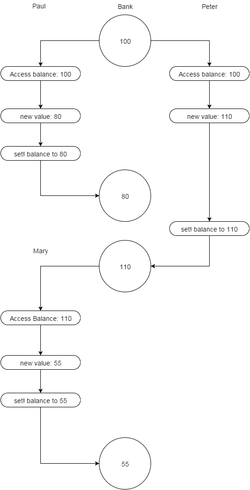
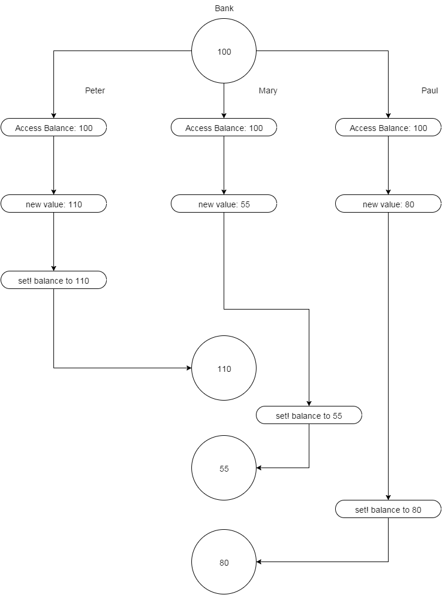
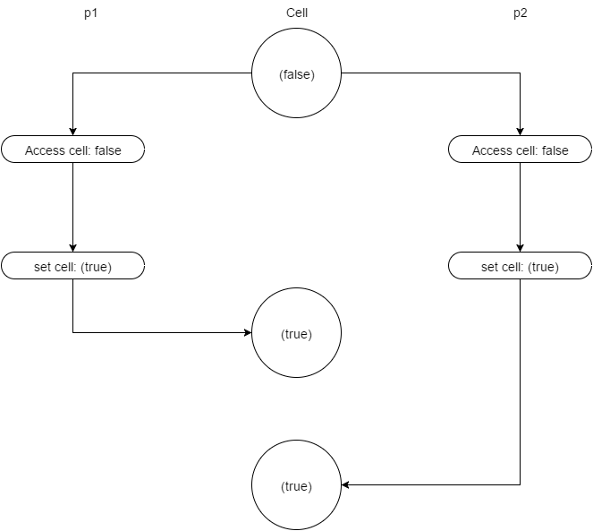

###Ex 3.38

A. If the system imposes *some* sequential ordering on the operations, then
   there are 6 different possible orderings:

   * Peter, Paul, Mary: $$110$$->$$90$$->$$45$$
   * Peter, Mary, Paul: $$110$$->$$55$$->$$35$$
   * Paul, Peter, Mary: $$80$$->$$90$$->$$45$$
   * Paul, Mary, Peter: $$80$$->$$40$$->$$50$$
   * Mary, Peter, Paul: $$50$$->$$60$$->$$40$$
   * Mary, Paul, Peter: $$50$$->$$30$$->$$40$$

B. Here are two possible scenarios:

  1. Both Paul and Peter base their calculation of the new `balance` value from
  an initial value of $$100$$, and Peter calls `set!` after Paul does, so that
  `balance` after both Peter and Paul are done is $$110$$, after wich Mary's
  operation runs, leaving a final value of $$55$$.

  

  2. All three operations read `balance` at the same time, so all calculations
  are based on an initial `balance` value of $$100$$, and Paul is the last to
  call `set!`, leaving a final value of $$80$$.

  


###Ex 3.39

Here is the code pretty-printed:

```scheme
(parallel-execute (lambda ()
                    (set! x
                          ((s (lambda () (* x x))))))
                  (s (lambda () (set! x (+ x 1)))))
```

So the entirety of $$P_2$$ is serialized, but for $$P_1$$, the only part that
is serialized are the two loads of `x` and the multiplicaiton.  What this means
is that both loads will always result in the same value, since it's no longer
possible for $$P_2$$'s `set!` to happen between the two loads. In the end, the
only possible value eliminated is $$110$, the other four are still possible:

* $$101$$: $P_1$$ sets `x` to $$100$$, then $P_2$$ increments to 101
* $$121$$: $$P_2$$ increments `x` to $$11$$ and then $$P_1$$ sets `x` to `x` times `x`
* $$11$$: $$P_2$$ accesses `x`, then $P_1$$ sets `x` to $$100$$, then $$P_2$$ sets `x`.

  Many people seem to think this one isn't possible, but I disagree.  It's
  possible for $$P_2$$'s load to happen immediately after $$P_1$$'s loads,
  causing them to both read $$10$$ as the value of `x`.  Since the assignment
  isn't serialized for $$P_1$$, it's possible for it to occur after $$P_2$$'s
  load, and before $$P_2$$'s store, so that $$P_1$$ will store $$100$$, then
  $$P_2$$ will overwrite it with $$11$$.

* $$100$$: $$P_1$$ accesses `x` (twice), then $$P_2$$ sets `x` to 11, then $$P_1$$ sets x.

  Note that is is almost the same as for the one above, except that $$P_1$$ is
  the last to store in this case.

###Ex 3.40

* $$100$$: $$P_1$$ and $$P_2$$ perform their respective accesses before any
  `set!`s happen, $$P_2$$ sets $$1000$$, then $$P_1$$ sets $$100$$.

* $$1000$$: $$P_1$$ and $$P_2$$ perform their respective accesses before any
  `set!`s happen, $$P_1$$ sets $$100$$, then $$P_2$$ sets $$1000$$.

* $$10000$$:  $$P_2$$ sets `x` to $$1000$$ between the first and second time
  $$P_1$$ accesses `x`.  Also possible if $$P_1$$ sets `x` to $$100$$ between
  $$P_2$$'s second and third access to `x`.

* $$100000$$: $$P_1$$ sets `x` to $$100$$ between $$P_2$$'s first and
  second access to $$x$$.

* $$1000000$$: $$P_1$$ sets `x` to $$100$$ before $$P_2$$ ever accesses `x`.
  Can also happen if $$P_2$$ sets `x` to $$1000$$ before $$P_1$$ ever accesses
  `x`.

If we modify it so that both processes are serialized:

```scheme
(define x 10)

(define s (make-serializer))

(parallel-execute (s (lambda () (set! x (* x x))))
                  (s (lambda () (set! x (* x x x)))))
```

then the only things that can happend are either $$P_1$$ starts and finishes
before $$P_2$$ can run, vice versa.  Regardless, the result will be the same:
$$(x^2)^3$$ = $$(x^3)^2 = 1000000$$.

###Ex 3.41

Yes, I think it's is possible that unsynchronized access to `balance` could
result in anomalous behavior, but only if reads and writes to `balance` were
not atomic.  That is, if an access can be be interleaved within `set!`, then
it's possible that we can start reading the data of `balance` while `set!` is
still writing to it, leaving us with garbage data.

###Ex 3.42

Yes, this is a safe change to make.  There is no difference in concurrency.  A
serializer protects calls to a procedure `p` via a `mutex`, wich is shared
among all procedures created by the serializer, so regardless if a serialized
procedure is reused or one is made on the fly, they will always attempt to
acquire the same mutex.

###Ex 3.43

Here is the program from the book that implements the exchange using
serializers:

```scheme
(define (serialized-exchange account1 account2)
  (let ((serializer1 (account1 'serializer))
        (serializer2 (account2 'serializer)))
    ((serializer1 (serializer2 exchange))
     account1
     account2)))
```

Since any interaction with an account is done through its serializer, we
guarantee that only one process can modify it at any given time.  In addition,
notice that the exchange operation serializes first on `account1`, then within
that, on `account2`.  This ensures the operation has exclusive access to both
of the accounts before proceeding.  If either or both of the accounts are in
use by any other processes, it must first wait until they become available.
This is enough to guarantee that the balances will always be $10, $20, and $30
because no two concurrent exchange operations that share either or both
accounts can occur at the same time.

Here is the original, unserialized `exchange` procedure:

```scheme
(define (exchange account1 account2)
  (let ((difference (- (account1 'balance)
                       (account2 'balance))))
    ((account1 'withdraw) difference)
    ((account2 'deposit) difference))
```

Let's suppose that we have three accounts `a1`, `a2`, and `a3`, having balances
$10, $20, and $30 respectively.  Also, there are two concurrent exchanges, one
between `a1` and `a2`, and the other between `a2`, and `a3`.  In this version,
the `'withdraw` and `'deposit` procedures are serialized, but nothing else.
Here is why, even with this version, the total sum will always be $60:

The interesting place here is interactions with `a2`, since that's the only
shared resource between the two concurrent exchanges.  Since `'withdraw` and
`'deposit` operations will serialize with each other (for the same account),
these operations will not interleave.  The first `exchange` operations, the one
between `a1` and `a2` will be withdrawin from this account, and the second
operation will be depositing to this account.  Either one could happen
first, but never at the same time.  However, since not all access to an account
is serialized, both exchange operations could calculate their difference values
*at the same time*, so that both exchanges will calculate a value of $$-10$$
for the difference in their accounts.

So, the first exchange will move $$10$$ from `a2` to `a1`, and the second
exchange will move $$10$$ from `a3` to `a2`.  Either the deposit into `a2` will
happen first, or the `withdraw` will, but never at the same time.  Regardless
of the order, `a2` will be left with $$20$$.  At the end, we'll end up with all
three accounts having a balance of $$20$$, which still gives us a total of
$$60$$.


The reason for this is that changes to an account's balance are still
serialized.  That means that we still have the (weaker) guarantee that
regardless of how many concurrent processes attempt modify an account, only one
is able to at a time.  Since any amount we remove from account, "correct" or
not, is always deposited to some other account, we still preserve the total
sum.  This guarantee, that sum of the balances across all the acounts will
remain intact, goes away when we don't serialize on the individual withdraw and
deposit operations.  Going back to our example above, if the deposit and
withraw interleave with each other, the final balance on `a2` could be
something unexpected.  For example, if both operations (the `deposit` and
`withdraw`) read a value of $$10$$ fo the balance, then `a2` could be left with
a balance of either $$10$$ if the first exchange writes `balance` last, or
$$30$$ if the second exchange writes last.  Regardless, the sum would either be
$$50$$ or $$70$$ which is not what we expect.


###Ex 3.44

As we saw in 3.43, if we're only concerned about preserving the total balance
among all the accounts, it's actually enough to only serialze on withdraws and
deposits into the account.  Since we can assume `from-account` has at least
`amount`, then Ben's solution is fine.  The difference between the two problems
is that the exchange problem moved a difference between the two accounts, which
it computed from their balances; here there is no such computation.


###Ex 3.45

The big problem with Louis' proposed solution is that for something like
`serialized-exchange`, a process will essentially have to serialized with
itself!  Here is why:

Let's take for example, a single exchange between accounts `a1` and `a2`.  In
summary, this is how `serialized-exchange` will work:

First it will go through `a1`'s serializer.  Since no other process is also
attempthing to access `a1`, this is fine.  Then it goes through `a2`'s
serializer.  Again, this is also okay.  However, the problem occurs when the
process attempts to `withdraw` from `a1`.  Since we're using the serialized
`withdraw`, we have to through the `a1`'s serializer again!  This time, we have
to wait because there's already a process running within the serializer: us!

The end result is that `serialized-exchange` will never finish, since the
`withdraw` cannot proceed until the process using the serializer is done, but
since that process is the one executing the `withdraw`, that will never happen.
This same problem will occur any time a single process goes through a
serializer, and then inside the serializer, it attempts to go through it again.

###Ex 3.46

As the book alludes to, the issue here is the same as some of our previous
examples inolving bank accounts.  The value in the cell is initially `false`,
and two concurrent `'acquire` procedures run, then it's possible that they both
acquire the mutex, which of course violates its purpose.



###Ex 3.47

Here is the first implementation using a mutex:

```scheme
(define (make-semaphore n)
  (let ((resources n)
        (m (make-mutex)))
    (define (p)
      (m 'acquire)
      (if (<= resources 0)
          (begin (m 'release)
                 (p))
          (begin (set! resources
                       (- resources 1))
                 (m 'release))))
    (define (v)
      (m 'acquire)
      (set! resources (+ resources 1))
      (m 'release))
    (define (the-semaphore m)
      (cond ((eq? m 'p) (p))
            ((eq? m 'v) (v))))
    the-semaphore))
```

We declare two variables, `resources`, to keep track of the number of available
resources, and `m` which is our mutex to serialize concurrent access to
`resources`.

For the `'p` or acquire method we begin by acquiring the mutex.  Then we check
if there are any available resources.  If there aren't, then we unlock the
mutex and try again.  If there are, we decrement `resources` and then unlock
the mutex.

the `'v` or `'release` method is simple, we just acquire the mutex, increment
`resources`, then release.

```scheme
(define (make-semaphore n)
  (let ((resources n)
        (cell (list false)))
    (define (p)
      (if (test-and-set! cell)
          (p)
          (begin
            (if (<= resources 0)
                (begin
                  (clear! cell)
                  (p))
                (begin
                  (set! resources (- resources 1))
                  (clear! cell))))))
    (define (v)
      (if (test-and-set! cell)
          (v)
          (begin
            (set! resources (+ resources 1))
            (clear! cell))))
    (define (the-semaphore m)
      (cond ((eq? m 'p) (p))
            ((eq? m 'v) (v))))
    the-semaphore))
```

The version using `test-and-set!` follows the same exact idea as the mutex
version; it's a little more tedious to serialize access to `resources`, but
not by much.

For `'p`, we essentially do the same thing `make-mutex` would do, which is to
continuosly `test-and-set!` the cell until we get `false`, and then proceed to
work with `resources` as we do in the mutex version of `make-semaphore`.  The
main difference here is that we explicitly busy-wait on two levels, the first
in order to get exclusive access to `resources`, and then we also busy-wait
until resource is greater than 0.

The `'v` or `release` procedure is also very much like the mutex version.

###Ex 3.48

As explained by the book, deadlock happens when process $$P_1$$ acquires some
locks, but is waiting for another process $$P_2$$ to release the rest of the
locks that it needs, and likewise, $$P_2$$ has some locks,and is waiting for
$$P_1$$ to release its locks.  For the set of locks $$L$$ that $$P_1$$ and
$$P_2$$ share, it can only happen that one process acquires some and the other
acquires the rest if they acquire them in different orders.  If we require the
two processes to always acquire them in a certain order, then the set cannot be
split among the two processes because in order to acquire the last lock
$$L_n$$, the process must have first acquire the previous lock $$L_{n-1}$$, and
so forth; i.e. whichever process acquires the very first lock in the ordering
will be the only allowed to acquire the remaining locks.


###Ex 3.49

Here's one example:

Consider two concurrent database transactions $$T_{1}$$ and $$T_{2}$$.  Each
transaction is identical: they query a single row, say $$R_a$$ for the first
transaction, and $$R_b$$ for the second, update one of their columns, then,
based on some factors, determines the set of rows related to the one just
updated, and proceeds to updat them.  Let's assume that each row is distinct.
However, when it comes to updating the related rows for $$R_a$$, it turns out
that one of them is $$R_b$$, and likewise, the set of related rows for $$R_b$$
includes $$R_a$$, and since updating the row will recquire locking it, this
results in a deadlock.
